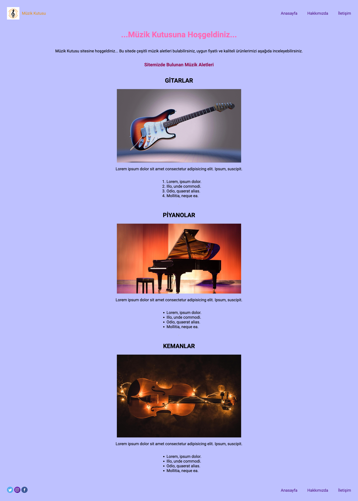

# Music Box Website

> In this assignment, you create a beautiful site with what you learned and researched using your imagination.

## Built With

- HTML
- External CSS

<!-- ## Live Demo (if available)

[Live Demo Link](https://livedemo.com) -->

## Project View

## Project Details

- CSS - How to Use Inline CSS
- Using Inline(Tag Specific), Internal(Same File) and External(CSS File) CSS
- Working with Callouts and General Font Properties
- Using Class and ID with CSS

<!-- ## Authors -->

## 👤 My Links

- GitHub: [Github](https://github.com/belifkutlu "my github profile")

- LinkedIn: [LinkedIn](https://www.linkedin.com/in/b%C3%BC%C5%9Fra-elif-kutlu-64a70b187/)

## 🤝 Contributing

Contributions, issues, and feature requests are welcome!

## Show your support

Give a ⭐️ if you like this project!
