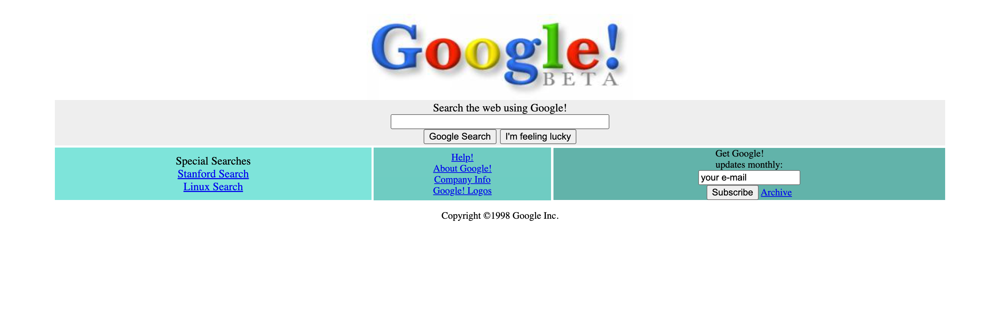

# Google Homepage - 1998

> Creating the 1998 version of Google

## Built With

- HTML
- CSS

<!-- ## Live Demo (if available)

[Live Demo Link](https://livedemo.com) -->

## Project View

## Project Details

- Working with CSS Selectors, Adding Properties to the HTML Tag Structure We Want
- Using CSS Box Properties (Margin, Padding, Width, Height)

<!-- ## Authors -->

## 🤝 Contributing

Contributions, issues, and feature requests are welcome!

## Show your support

Give a ⭐️ if you like this project!
