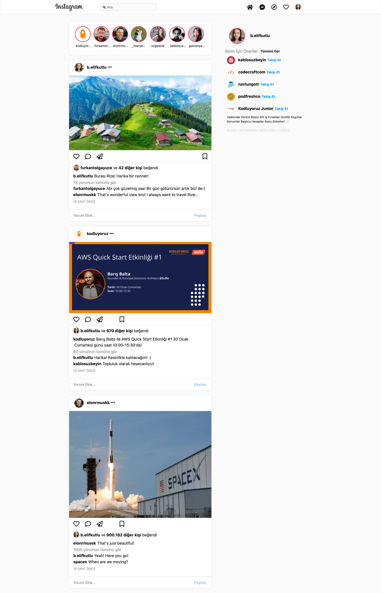

# Bootstrap Instagram Clone

> Simple HTML Instagram clone made with Bootstrap.

## Built With

- HTML
- CSS
- Bootstrap

<!-- ## Live Demo (if available)

[Live Demo Link](https://livedemo.com) -->

## Project View

## Project Details

- Understanding the 12 Grid System
- Bootstrap - General Container, Row Blocks and Column Structure
- Bootstrap - Screen Resolution / Device Responsive Column Structure Usages
- Bootstrap - Using Row Blocks
<!-- ## Authors -->

## Contributing

Contributions, issues, and feature requests are welcome!

## Show your support

Give a ⭐️ if you like this project!
