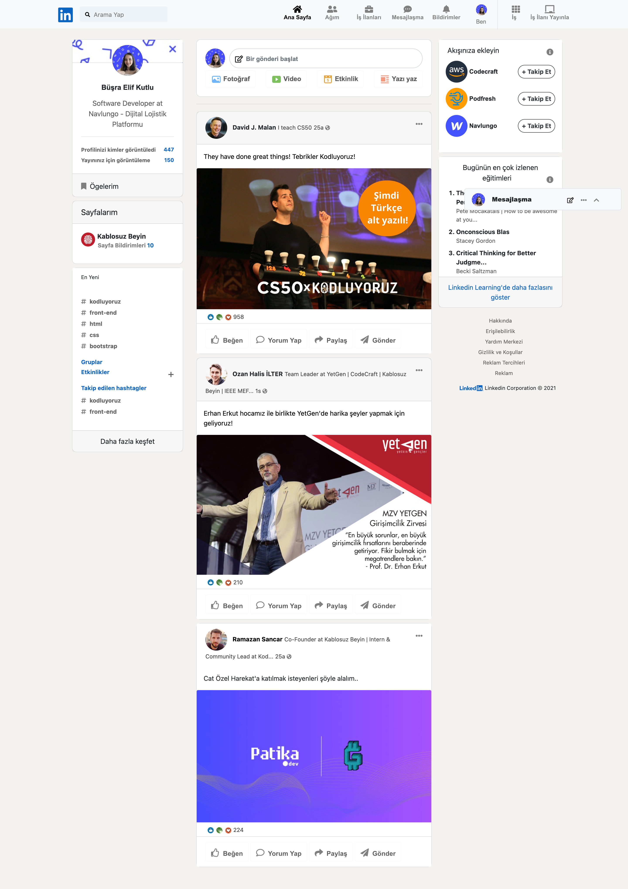

# Bootstrap Linkedin Clone

> Simple HTML Linkedin clone made with Bootstrap.

## Built With

- HTML
- CSS
- Bootstrap

<!-- ## Live Demo (if available)

[Live Demo Link](https://livedemo.com) -->

## Project View

## Project Details

- Using Bootstrap Color Standards, Typography, Margin and Padding
- Showing / Hiding Desired Blocks According to Responsive Structure with Display Properties
- Bootstrap - Using Offset
- Organizing Reactions by Responsive Structure Using Bootstrap Sorting Features
<!-- ## Authors -->

## Contributing

Contributions, issues, and feature requests are welcome!

## Show your support

Give a ⭐️ if you like this project!
